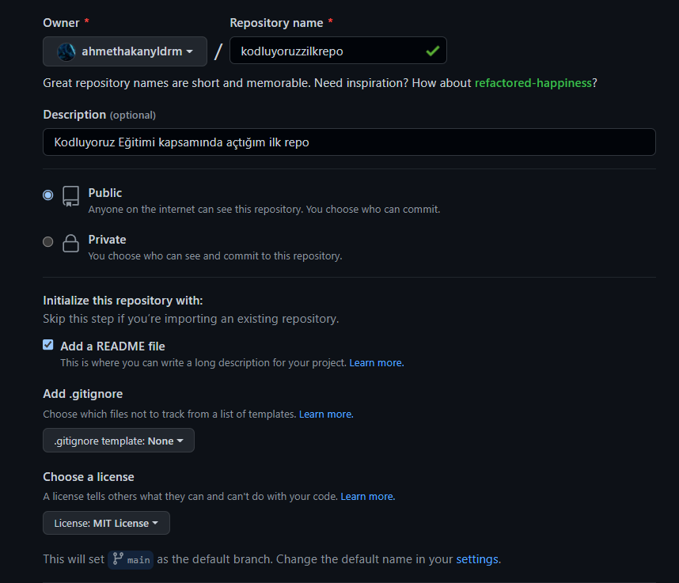

# Kodluyoruz İlk Repo

Kodluyoruz Eğitimi kapsamında açtığım ilk repo



Bu repo [Kodluyoruzun](https://kodluyoruz.org) Git eğitiminde oluşturduğumuz ilk repo .
İçerisinde bir adet Readme dosyası bulunuyor .

## Installation

Öncelikle bu projeyi clonelayın.

```bash
git clone <https://github.com/ahmethakanyldrm/Kodluyoruz-lkRepo.git>
```

## Usage

Projeyi cloneladıktan sonra Visual Studio Code Programında açınız.

```windows
cd kodluyoruzzilkrepo
code .
```

## Contributing

Pull requestler kabul edilir.Büyük Değişiklikler için , lütfen önce neyi değiştirmek istediğinizi tartışmak için bir konu açınız.

## License

[MIT](https://choosealicense.com/licenses/mit/)
